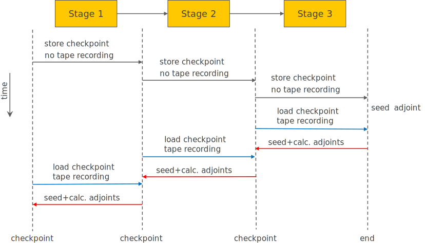

# Checkpointing

Checkpointing is a technique to reduce the memory footprint of the tape
in adjoint mode algorithmic differentiation.
Instead of recording the full algorithm on tape,
which can quickly result in gigabytes of memory in a large computation,
the tape is recorded for specific stages of the algorithm, one at a time.
This is illustrated in the following figure:



The algorithm is divided into stages,
where the input data of each stage is stored in a checkpoint
and the outputs are computed passively (without recording on tape).
Once the final output of the algorithm is computed,
the adjoint of the output is initialized
and at each checkpoint during tape rollback:

1.  The inputs to the checkpoint are loaded,
2.  The operations of this stage only are recorded on tape,
3.  The output adjoints of this stage are initialized,
4.  The tape is rolled back for this stage, computing the adjoints of the stage inputs,
5.  The input adjoints are incremented by these values, and
6.  The tape is wiped before proceeding with the previous stage.

Using this method,
the tape memory is limited by the amount needed to record one algorithm stage
instead of the full algorithm.
However, each forward computation is computed twice,
hence checkpointing trades computation for memory.

In practice, as using less memory leads to higher cache-efficiency,
checkpointing may be faster overall than recording the full algorithm
even though more computations are performed.

## Example Algorithm

To demonstrate the checkpointing method,
we choose a simple repeated application of the sine function to a single input:

```c++
template <class T>
void repeated_sin(int n, T& x)
{
    for (int i = 0; i < n; ++i)
    x = sin(x);
}
```

We divide the for loop into equidistant stages and insert a checkpoint at each
of these.

## Checkpoint Callback

To create a checkpoint,
we need to store the inputs of the stage and the slots in the tape for the inputs
and outputs in a callback object inheriting from [`CheckpointCallback`](../ref/chkpt_cb.md#checkpointcallback).
The virtual method [`CheckpointCallback::computeAdjoint`](../ref/chkpt_cb.md#computeadjoint)
needs to be overridden to perform the per-stage adjoint computation.
As all stages are identical, we choose to implement the functionality of all
checkpoints within a single callback object
and store the required inputs in a stack data structure.
Alternatively we could have created a new checkpoint callback object at every
checkpoint.
The prototype for our callback is:

```c++
template <class Tape>
class SinCheckpointCallback : public xad::CheckpointCallback<Tape>
{
public:
    typedef typename Tape::slot_type   slot_type;   // type for slot in the tape
    typedef typename Tape::value_type  value_type;  // double
    typedef typename Tape::active_type active_type; // AReal<double>

    active_type computeStage(int n, active_type& x); // forward computation
    void computeAdjoint(Tape* tape) override;        // adjoint computation

private:
    std::stack<int> n_;                    // number of iterations in this stage
    std::stack<value_type> x_;             // input values for this stage
    std::stack<slot_type> slots_;          // tape slots for input and output
};
```

For convenience of implementation,
we added the forward computation for one stage within the same class
in the `computeStage` method,
which could also be performed outside of the object.

### `computeStage` Method

Within the `computeStage` method,
we first store the input value, the number of iterations,
and the slots of the input in the checkpoint object:

```c++
n_.push(n);
slots_.push(x.getSlot());
value_type x_p = value(x);
x_.push(x_p);
```

We then compute the stage with the passive variable (not recording on the tape):

```c++
repeated_sin(n, x_p);
```

The value of the output active variable needs to be updated with the result
and we need to store the slot of the output variable in the checkpoint also:

```c++
value(x) = x_p;
slots_.push(x.getSlot());
```

Note that we did not need to register `x` as an output with the tape here,
as we had to do with the external functions example before,
since the variable is already registered on tape (it's both input and output).

What is left is to register this callback object with the tape so that its
`computeAdjoint` method is called at this point when the tape is rolled back:

```c++
Tape::getActive()->insertCallback(this);
```

### `computeAdjoint` Method

The `computeAdjoint` method is called automatically by XAD
at the checkpoints in the tape.
We first need to load the inputs to this computation stage and
obtain the adjoint of the output:

```c++
slot_type outputidx = slots_.top();  slots_.pop();
slot_type inputidx = slots_.top();   slots_.pop();
int n = n_.top();                    n_.pop();
value_type outputadj = tape->getAndResetOutputAdjoint(outputslot);
```

The function [`Tape::getAndResetOutputAdjoint`](../ref/tape.md#getandresetoutputadjoint) reads the adjoint
corresponding to the slot given and resets it to 0.
This reset is generally required as the variable corresponding to the slot
may be re-used (overwritten) in the algorithm,
as is the case in the `repeated_sin` function.

We now want to use XAD to compute the adjoints just for this computation
stage.
This is performed by creating a nested recording within the global tape,
than can be rolled back individually:

```c++
active_type x = x_.top();               // local independent variable
x_.pop();
tape->registerInput(x);                 // need to register to record
   
xad::ScopedNestedRecording<Tape> nested(tape);  // nested recording
repeated_sin(n, x_ad);                  // run actively
tape->registerOutput(x);                // register x as an output
derivative(x) = output_adj;             // set output adjoint
nested.computeAdjoints();               // rollback nested tape

nested.incrementAdjoint(inputslot, derivative(x));  // incr. input adjoint
```

In a similar fashion to simple adjoint mode (see [Basic Usage](basic.md#adjoint-mode)),
we first initialize the local independent variables as active data types
and start a nested recording.
This is performed by creating a local object `nested` of type
[`ScopedNestedRecording`](../ref/tape.md#scopednestedrecording),
which wraps calls to [`Tape::newNestedRecording`](../ref/tape.md#newnestedrecording) in its constructor
and [`Tape::endNestedRecording`](../ref/tape.md#endnestedrecording) in its destructor.
It is recommended to use the [`ScopedNestedRecording`](../ref/tape.md#scopednestedrecording) for this
purpose to make sure the nested recording is always finished when the scope is left.

Next we record the operations for this stage by running the algorithm actively.
We then set the adjoint of the output and compute the adjoints of the inputs.
The adjoints of the inputs to this stage can then be incremented.

Note that when the `nested` object goes out of scope,
i.e. when its destructor is called,
the nested tape for this computation stage is wiped and the memory can be
reused for the previous stage.
This saves overall memory.

## Call-Site

The full algorithm with checkpointing can then be initiated as follows:

```c++
tape_type tape;

AD x_ad = x;                             // initialized indepedent variables
tape.registerInput(x_ad);                // register with the tape
tape.newRecording();                     // start recording derivatives

SinCheckpointCallback<tape_type> chkpt;  // setup checkpointing object

int checkpt_distance = 4;                // we checkpoint every 4 iterations
for (int i = 0; i < n; i += checkpt_distance)
{
    int m = min(checkpt_distance, n-i);
    chkpt.computeStage(m, x_ad);             // one computation stage
}

tape.registerOutput(x_ad);
derivative(x_ad) = 1.0;
tape.computeAdjoints();

std::cout << "xout       = " << value(x_ad) << "\n"
          << "dxout/dxin = " << derivative(x_ad) << "\n";
```

This follows largely the same procedure as given in [Basic Usage](basic.md#adjoint-mode),
but setting up the checkpoint object and calling its `computeStage` member
for every stage of the algorithm (4 iterations in this example).

!!! note

    It is important that the checkpoint callback object is valid when
    [`Tape::computeAdjoints`](../ref/tape.md#computeadjoints) is called. 
    It should not be destroyed before.

See [Checkpoint Callback Memory Management](../ref/tape.md#checkpoint-callback-memory-management) 
for how to use tape-based destruction with
dynamically allocated checkpoint callbacks.

!!! note "See also"

    This example is included with XAD ([`checkpointing`](https://github.com/auto-differentiation/XAD/tree/main/samples/checkpointing)).

## Other Usage Patterns

Alternative methods may be used to update the adjoints
within a checkpoint's [`CheckpointCallback::computeAdjoint`](../ref/chkpt_cb.md#computeadjoint) method,
such as:

*   Forward mode algorithmic differentiation within an outer adjoint mode
*   Finite differences (bumping)
*   Analytic derivatives
*   External library functions (see [External Functions](external_functions.md))

Checkpointing can also be used recursively,
i.e., new checkpoints are created within a nested tape in a checkpoint.

The benefits of each of these approaches are highly application-dependent.
